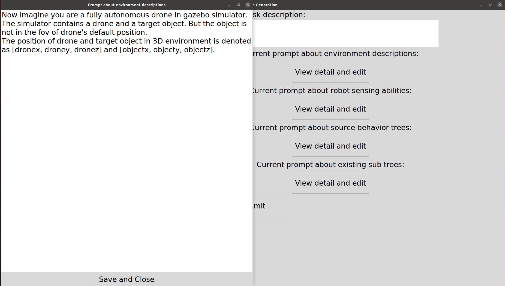

# Behavior Tree Generation


## Before you start
* Make sure you have the authentication to these repos [behavior_tree](https://github.com/ARG-NCTU/behavior_tree.git) and [behavior_tree_msgs](https://github.com/ARG-NCTU/behavior_tree_msgs).
* Clone these repos in same workspace:
```
cd ${YOUR_WORKSPACE}/catkin_ws/src
```
```
git clone git@github.com:ARG-NCTU/behavior_tree.git
```
```
git clone git@github.com:ARG-NCTU/behavior_tree_msgs.git
```
* And also clone this repo:
```
git clone git@github.com:ARG-NCTU/bt_prompt.git
```
* Build before you run it.
```
cd ${YOUR_WORKSPACE}/catkin_ws
```
```
cakin_make
```
or
```
catkin_build -w ${YOUR_WORKSPACE}/catkin_ws
```
* You need to export your OPENAI_API_KEY to environment.
```
export OPENAI_API_KEY=${your_key_here}
```
## Params
* There are several params in [bt_prompt/launch/bt_prompt_gui.launch](https://github.com/ARG-NCTU/bt_prompt/blob/master/launch/bt_prompt_gui.launch):
     
    * <trigger_rosparam>(default: /LLM_generation_finished): This param define the name of a specified rosparam to trigger behavior tree node if generation is finished.
    * <model_name>(default: gpt-3.5-turbo-instruct / text-davinci-003(deprecated)): The large language model you what to choose.([You can see the available models here](https://platform.openai.com/docs/models/overview))

* And [behavior_tree/launch/behavior_tree.launch](https://github.com/ARG-NCTU/behavior_tree/blob/master/launch/behavior_tree.launch) also needs the follwing params:
    * <wait_for_generation>(default: false): A special param, define whether behavior need to wait tree config provided by LLM-generation.
    * <trigger_rosparam>(default: /LLM_generation_finished): This param define the name of a specified rosparam to trigger behavior tree node if param <wait_for_generation> is True.
    * <tree>:The config file for behavior tree node to read.
## How to run
* First, start bt_prompt_gui.launch: 
```
roslaunch bt_prompt bt_prompt_gui.launch trigger_rosparam:="/LLM_generation_finished" model_name:="gpt-3.5-turbo-instruct"
```
* Second, start behavior_tree.launch: 
```
roslaunch behavior_tree behavior_tree.launch wait_for_generation:="true" trigger_rosparam:="/LLM_generation_finished" tree:="drone_latching/LLM_generated.tree"
```
* Third, start behavior_tree_rqt.launch: 
```
roslaunch behavior_tree behavior_tree_rqt.launch 
```
## Choose and modify the prompts


* As the user interface shown, there are one varient input:
    * Task description(key in the requirements you need)

* And four primitive prompts that can direct enable/disable via the select buttons left hand side:([you can see the full context here](https://github.com/ARG-NCTU/bt_prompt/tree/master/config/prompt))
    * Environment descriptions
    * Robot sensing abilities
    * Source behavior trees
    * Existing sub trees

* You can also view the details and edit primitive prompts by using the "view detail and edit" buttons right hand side:


* Click the "Submit" button to start generate behavior tree.

* The detailed demostration can refer this video:
[watch demo video in youtube](https://www.youtube.com/watch?v=mlQ-oJ7MDe0)